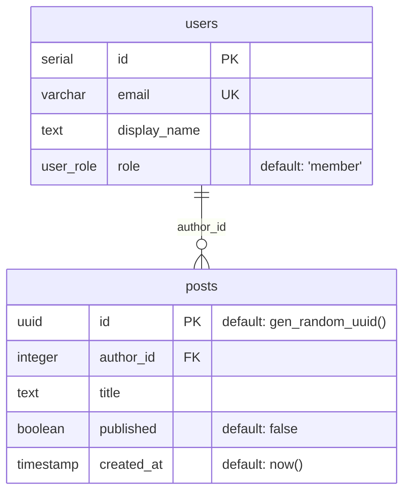

# drizzle-to-erd

Generate a Mermaid `erDiagram` from your Drizzle ORM schema. Hooks into the same `drizzle.config.ts` you already use for migrations.



## Install

```bash
bun add -d drizzle-to-erd
```

`drizzle-orm` is a peer dependency — it should already be in your project. Image output uses `@viz-js/viz` (Graphviz WASM) and `@resvg/resvg-js` (PNG rasterizer) — both installed automatically.

## CLI

```bash
# print Mermaid to stdout
bunx drizzle-to-erd

# write a ```mermaid```-fenced markdown file
bunx drizzle-to-erd --out ERD.md

# raw mermaid without the fence
bunx drizzle-to-erd --format raw --out schema.mermaid

# SVG image (auto-detected from .svg extension)
bunx drizzle-to-erd --out ERD.svg

# PNG image (auto-detected from .png extension; requires @resvg/resvg-js)
bunx drizzle-to-erd --out ERD.png

# explicit format
bunx drizzle-to-erd --format svg --out ERD.svg

# skip column attributes (entities + relationships only)
bunx drizzle-to-erd --no-attributes

# custom config path
bunx drizzle-to-erd --config ./configs/drizzle.config.ts
```

The CLI looks for `drizzle.config.{ts,js,mts,mjs,cts,cjs}` in the current working directory by default.

### Options

| Flag | Description |
| --- | --- |
| `-c, --config <path>` | Path to drizzle config (default: `./drizzle.config.*`) |
| `-o, --out <path>` | Output file (default: stdout) |
| `-f, --format <md\|raw\|svg\|png>` | Output format. Default: inferred from `--out` extension (`.svg`/`.png`/`.md`), else `raw` if no `--out` |
| `--no-attributes` | Skip column attributes (entities + relationships only) |
| `-h, --help` | Show help |

### Image output

The `--format svg` and `--format png` modes render your schema as a real ER diagram (boxes for tables, crow's-foot edges for relationships) via Graphviz. No external service, no browser, no CLI subprocess — everything runs in-process via WASM.

Add the rendered SVG to your README:

```md

```

PNG output rasterizes the SVG via `@resvg/resvg-js` at 1600px wide. If that dep is missing, the CLI errors with a clear install command.

## Programmatic API

```ts
import * as schema from "./src/schema";
import { generate, emitSvg, emitPng, emitDot } from "drizzle-to-erd";

const mermaid = await generate({ schema });               // → string (mermaid)
const svg = await generate({ schema }, "svg");            // → string (svg)
const png = await generate({ schema }, "png");            // → Uint8Array (png)
const dot = emitDot(/* IR tables */);                     // → string (graphviz dot)
```

The lower-level `emitSvg` / `emitPng` / `emitDot` / `emitMermaid` functions take a pre-introspected IR array of tables — useful when you want to wire your own pipeline.

Or point it at your config:

```ts
import { generate } from "drizzle-to-erd";

const mermaid = await generate({ configPath: "./drizzle.config.ts" });
```

## How it works

1. Loads your `drizzle.config.ts` (or accepts a `schema` object directly)
2. Resolves the `schema` glob, dynamically imports each file, and collects any Drizzle `Table` exports
3. For each table, calls `getTableConfig()` from `drizzle-orm/pg-core` to extract columns, foreign keys, and unique constraints
4. Renders the IR to a Mermaid `erDiagram` string

## Supported

- **Dialect**: PostgreSQL (via `drizzle-orm/pg-core`). MySQL/SQLite support is on the roadmap.
- **Schema definitions**: `pgTable` only in v1. `pgSchema('name')` wrappers (multi-schema setups) are not yet handled.
- **Relationship discovery**: foreign keys via `.references()`. Implicit M2M via `relations()` is not yet wired up.

## v1 limitations

- Only `dialect: "postgresql"` configs are accepted — other dialects will throw a clear error.
- `relations()` definitions are ignored; only `.references()` foreign keys are reflected.
- Default value rendering is best-effort for SQL defaults (it walks `queryChunks` for string chunks).
- Self-references work, but Mermaid renderers vary in how they draw the resulting loop.

## Roadmap

The IR layer is already dialect-agnostic, so most of these are localized additions.

### Next up

- **MySQL dialect** — add `src/introspect/mysql.ts`, dispatch on `config.dialect`. The `getTableConfig` shape mirrors PG.
- **SQLite dialect** — same pattern via `drizzle-orm/sqlite-core`.
- **`relations()` support** — use `extractTablesRelationalConfig` to render implicit many-to-many and unmodeled relationships that don't have real FKs.
- **`pgSchema('name')` multi-schema** — detect and prefix entity names with the schema (e.g. `auth_users`) so diagrams stay unambiguous.

### Nice-to-haves

- **`--watch` mode** — regenerate on schema file changes.
- **DBML emitter** — alternative to Mermaid, for `dbdiagram.io` users.
- **JSDoc column comments** — surface `/** ... */` comments above column definitions into Mermaid attribute `"comment"` slots.
- **Composite FKs** — multi-column foreign keys are currently noted in the relationship label but not tagged on individual columns.
- **Richer SQL default rendering** — handle params, function calls, and casts in `queryChunks` (currently string-chunks only).
- **Publish to npm** — flip `private: false`, set the version, add `publishConfig`.

### Done

- **SVG/PNG image output** — `src/emit/dot.ts` (Graphviz dot) + `src/emit/image.ts` (`@viz-js/viz` for SVG, `@resvg/resvg-js` for PNG). Pure WASM, no Chrome subprocess. Format is auto-detected from `--out` extension.

## Development

```bash
bun install
bun test
```

Add a fixture schema, then:

```bash
bun run src/cli.ts --config tests/fixtures/drizzle.config.ts
```
